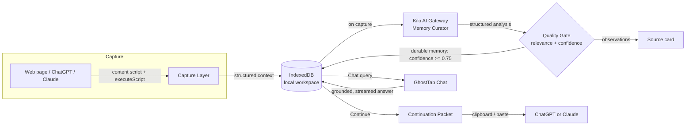
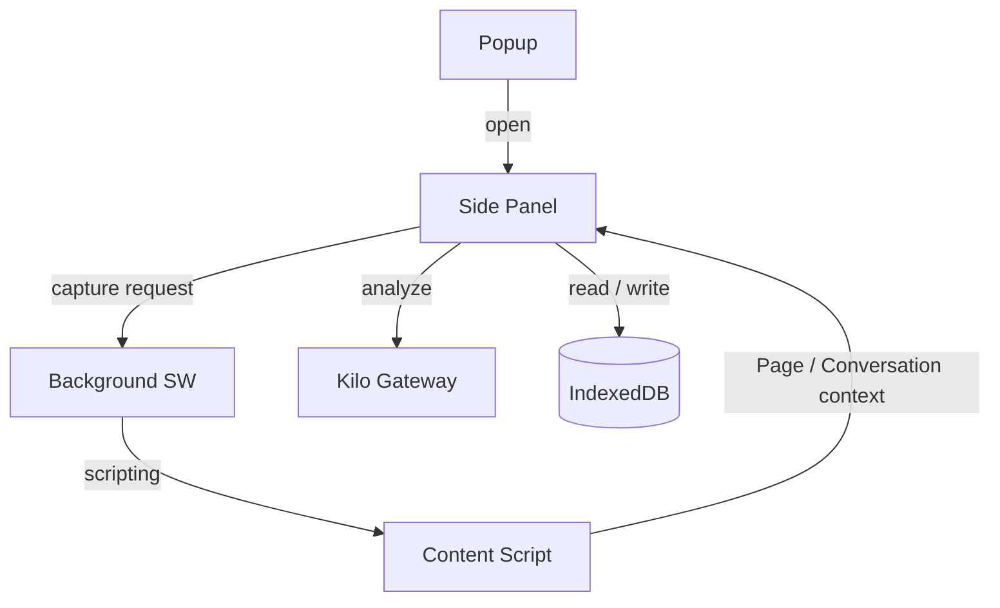

# 👻 GhostTab

> **Your work follows you — not the AI.** A universal, **local-first** context layer for the web.

GhostTab is a Chrome extension (Manifest V3) that turns the tabs you actually
work in into persistent, queryable **workspace memory** — then lets you carry
that memory into any AI tool.


---

## ✨ What it does

- **Capture anything.** One click grabs the current tab — a normal webpage, a
  GitHub issue, documentation, or a full **ChatGPT / Claude conversation**
  (including long, virtualized threads that other tools silently miss).
- **Distill, don't dump.** Captured context is sent to an AI *Memory Curator*
  that extracts only **durable, decision-relevant** memory — decisions, goals,
  questions, and facts — and scores each for confidence.
- **Remember locally.** Everything lives in your browser's IndexedDB. Raw page
  text and conversation transcripts are **never** sent whole to any provider;
  only a compact summary goes to the AI.
- **Continue anywhere.** Generate a compact *continuation packet* and paste it
  into ChatGPT or Claude to pick up exactly where you left off — with the right
  context, not a blank slate.
- **Chat with your workspace.** A built-in **Chat** tab lets you ask GhostTab
  about any workspace — "What decisions have we made?", "Summarize this
  project" — and **teach or forget** things by chatting (`remember …` /
  `forget …`).

---

## 🤔 The problem it solves

Modern AI tools are amnesic. Every new chat, tab, or tool starts from zero. You
re-explain your project, re-paste your goals, and re-derive decisions you
already made — while your real context is scattered across dozens of tabs, docs,
and chat logs.

GhostTab targets three concrete pain points:

| Problem | How GhostTab fixes it |
| --- | --- |
| **Shallow capture** — virtualized chat UIs only expose part of a long conversation | A self-contained injected scroller walks ChatGPT / Claude, auto-scrolling and de-duplicating turns until the whole thread is collected. |
| **Memory pollution** — dev / implementation noise leaks into "memory" | A strict **Memory Curator** quality gate rejects UI chrome, greetings, build logs, and phase labels, keeping only genuinely useful, durable memory. |
| **Context lost between tools** — you can't move context from ChatGPT to Claude | The **Continue** flow assembles a deterministic, token-bounded packet from workspace memory + top-relevance sources and hands it to the next tool. |

---

## 🧠 How it works



1. **Capture** — a content script + `chrome.scripting.executeScript` reads the
   active tab into a clean `PageContext` or `ConversationContext` (headings,
   readable text, message turns).
2. **Store locally** — the context is written to IndexedDB under the active
   workspace *before* any AI call.
3. **Analyze** — the structured context is sent to the Kilo AI Gateway; the
   model returns a `summary`, a `relevance` score, and candidate `memories`.
4. **Quality gate** — candidates with `confidence ≥ 0.75` become durable
   workspace memory; lower-confidence items stay attached to the source as AI
   observations (no false memory).
5. **Continue** — a *continuation packet* is assembled from durable memory +
   the most relevant sources and copied to the clipboard for the next AI
   session.

---

## 💬 Chat with your workspace

GhostTab isn't just a passive memory store — it can **talk back**. Switch to
the **Chat** tab in the side panel and ask anything about the selected
workspace. The assistant is grounded entirely in that workspace's local memory
and sources, so it never invents details.

**Why it's different**
- **Live token streaming.** Responses stream in token-by-token over a
  Server-Sent-Events connection to the Kilo gateway, with an automatic one-shot
  fallback if streaming isn't supported — you start reading the answer
  immediately instead of waiting for the whole response.
- **Clean plain-text output.** Every reply is rendered as plain text only — no
  markdown, no headings, no bold or italics, no bullet lists, and **no
  asterisks anywhere**. A post-processor strips any residual formatting so the
  chat always looks consistent.
- **Grounded, not hallucinated.** The model only sees a compact workspace
  snapshot (goal, decisions, goals, open questions, facts, and the top sources
  by relevance). Full page text and raw conversation transcripts are never
  sent.
- **Works without a key.** With no Kilo API key entered, GhostTab falls back to
  a fast, deterministic local answer pulled straight from your stored memory.

**Teach it by chatting — remember & forget**

You can edit workspace memory through conversation:

| You type… | What happens |
| --- | --- |
| `remember we chose Postgres for the backend` | Adds a durable memory item (defaults to a *fact*) |
| `remember decision: we picked Postgres` | Adds a *decision* memory item |
| `forget the old API design` | Removes memory items whose text contains every word in your query |
| `forget our staging URL` | Removes the matching memory |

Changes apply instantly to local IndexedDB and the assistant's context updates
on the next message. Commands are scoped to *memory* items only, so chatting
can never delete your captured pages or conversations.

---

## 🏗️ Architecture

GhostTab is a single MV3 extension with four cooperating surfaces:



- **Popup** (`src/popup`) — a lightweight entry point whose only job is to open
  the side panel.
- **Side Panel** (`src/sidepanel`) — the full app: workspaces, memory, sources,
  settings, the **Chat** tab, and the Continue flow. A top-level
  `Workspace | Chat` switch scopes chat to the selected workspace.
- **Content Script** (`src/content`) — page presence + context extraction, with
  per-platform adapters (`chatgpt.ts`, `claude.ts`, `generic.ts`).
- **Background Service Worker** (`src/background`) — message router and side-panel
  opener.
- **Storage** (`src/lib/storage`) — a promise-based IndexedDB wrapper. UI never
  touches IndexedDB directly.
- **AI engine** (`src/lib/ai`) — provider-agnostic client, prompts, analysis
  parser, and continuation builder.

### Project structure

```
src/
├── background/        # MV3 service worker (message router)
├── content/           # content script + extractors
│   └── platforms/     # chatgpt | claude | generic adapters
├── lib/
│   ├── ai/            # Kilo client, Memory Curator prompts, analysis, continue
│   ├── context/       # page / conversation → ContextItem builders
│   ├── storage/       # IndexedDB wrapper (workspaces, items, state, meta)
│   └── utils/         # cn, format, relevance helpers
├── components/        # UI (cards, modal, toasts, brand, ChatView…)
│   └── ui/            # Button, Card, Badge, Switch, IconButton
├── popup/             # toolbar popup
├── sidepanel/         # main app + views
│   └── views/         # list | detail | source | settings
├── styles/            # design tokens + globals
├── manifest.ts        # MV3 manifest (built via CRXJS)
└── types/index.ts     # shared domain + messaging types
```

---

## 🛠️ Tech stack

- **TypeScript 5** + **React 18**
- **Vite 5** + **@crxjs/vite-plugin** (MV3 build)
- **Tailwind CSS** with a unified design-token system (`tokens.css`)
- **IndexedDB** for local-first storage
- **Kilo AI Gateway** (OpenAI-compatible) for memory analysis

---

## 🚀 Getting started

### Prerequisites

- Node.js 18+
- A Chromium browser (Chrome / Edge / Brave)
- A Kilo API key *(optional — a safe dev fallback runs without one)*

### Install & run

```bash
npm install
npm run dev        # launch the CRXJS dev server with HMR
```

### Build

```bash
npm run build      # type-check + produce dist/ (loadable extension)
npm run preview    # preview the built extension
```

### Load in Chrome

1. Open `chrome://extensions`, enable **Developer mode**.
2. Click **Load unpacked** and select the `dist/` folder.
3. Click the GhostTab toolbar icon → **Open Side Panel**.
4. *(Optional)* Add your Kilo API key in **Settings**; without it, capture still
   works in dev-fallback mode.

### Configuration

Copy `.env.example` to `.env` (or set values in Settings) and provide:

```ini
VITE_KILO_API_KEY=sk-...
VITE_KILO_MODEL=tencent/hy3:free
```

The key is sent **only** to the Kilo gateway at capture time and is stored
locally in the browser.

> **Model note:** the default `tencent/hy3:free` model works **without** signing
> in to Kilo and is what GhostTab uses out of the box. Some models (e.g.
> `anthropic/claude-sonnet-4.5`) require a signed-in Kilo account and return
> `PAID_MODEL_AUTH_REQUIRED`; GhostTab automatically retries with the fallback
> free model if that happens.

---

## 🔒 Privacy & local-first

- All workspace memory and captured context is stored **locally in IndexedDB**
  on your machine.
- Raw page text and full conversation transcripts are **never** sent to any
  provider — only a compact summary and structured turns go to the AI.
- No backend, no accounts, no telemetry. The extension talks only to the AI
  gateway you configure. Chat sends just the compact workspace snapshot and
  your question — never raw page text or full conversation transcripts.

---

## 🎯 Features

- 🗂️ Multiple **workspaces**, each with a goal and its own memory.
- 💬 **Deep conversation capture** for ChatGPT & Claude (handles virtualized
  threads).
- 🧠 **Memory Curator** quality gate (confidence threshold + de-duplication).
- 🔍 Per-source **AI analysis** with summary, relevance, and raw model response.
- 📋 **Continue** flow → copy a bounded context packet into ChatGPT or Claude.
- 🎨 Unified dark **design system** via CSS variables + Tailwind tokens.
- 💡 In-panel **Chat** with live token streaming and clean plain-text replies.
- 🧩 **Remember / forget by chat** — edit workspace memory conversationally.
- ⚙️ Settings: API key, model, auto-capture, clipboard fallback.

---

## 📜 Scripts

| Script | Description |
| --- | --- |
| `npm run dev` | CRXJS dev server with HMR |
| `npm run build` | Type-check then build `dist/` |
| `npm run build:only` | Build `dist/` without type-check |
| `npm run preview` | Preview the built extension |
| `npm run typecheck` | `tsc --noEmit` |

---

## 🗺️ Roadmap

- Richer chat grounding (follow-up questions, source citations)
- Cross-device sync (opt-in, encrypted)
- More platform adapters (Notion, Linear, StackOverflow…)
- One-click "Continue in tool" deep links

---

## 🤝 Contributing

Contributions are welcome! Open an issue or PR. Please keep the **provider
architecture stable** and respect the local-first, privacy-by-default design.

---

## 📄 License

Released under the [MIT License](./LICENSE).

---

### 🏷️ Topics

`chrome-extension` · `manifest-v3` · `react` · `typescript` · `vite` ·
`crxjs` · `ai` · `context-management` · `productivity` · `local-first` ·
`tailwindcss` · `indexeddb`
